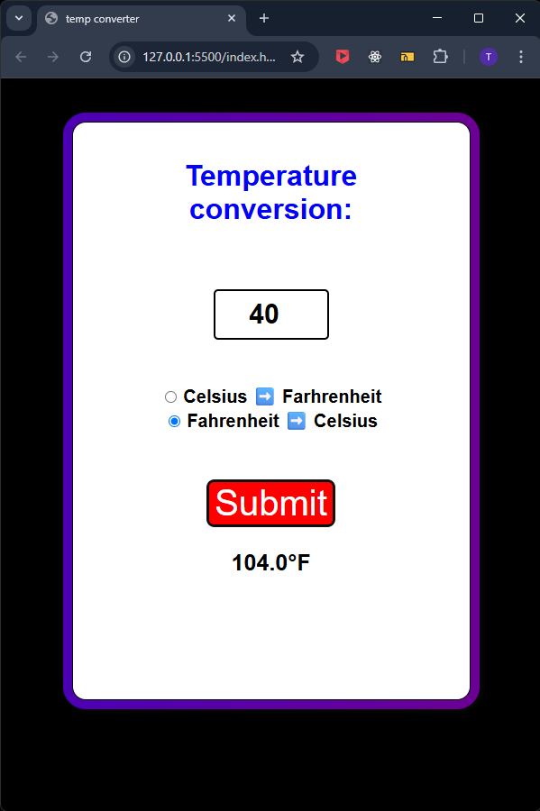

# 🌡️ Temperature Conversion App

This is a simple web application that allows users to convert temperatures between Celsius, Fahrenheit, and Kelvin using a clean and user-friendly interface.

## 🔧 Features

- Convert between:
  - Celsius to Fahrenheit/Kelvin
  - Fahrenheit to Celsius/Kelvin
  - Kelvin to Celsius/Fahrenheit
- Real-time conversion as user inputs data
- Responsive and clean design
- Built with basic HTML, CSS, and JavaScript


## 🛠️ Tech Stack

- **HTML5** – Markup structure
- **CSS3** – Styling and layout
- **JavaScript (Vanilla)** – Logic for converting temperatures

## 🚀 Getting Started

To run the project locally:

1. Clone the repository:
   ```bash
   git clone https://github.com/your-username/temperature-converter.git

## 📸 Preview

  
  
  


✨ Future Improvements

Add unit switch dropdowns

Improve mobile responsiveness

Add error handling for invalid input

Include dark mode


## 📇 Author

**Tshepang Oliver**  
Frontend Developer   
- 🔗 [GitHub](https://github.com/T5H3P4N9)  
- 🔗 [LinkedIn](https://www.linkedin.com/in/tshepang-oliver-3a5540205/)
- 📧 [Email](mailto:olivertshepang@gmail.com)


